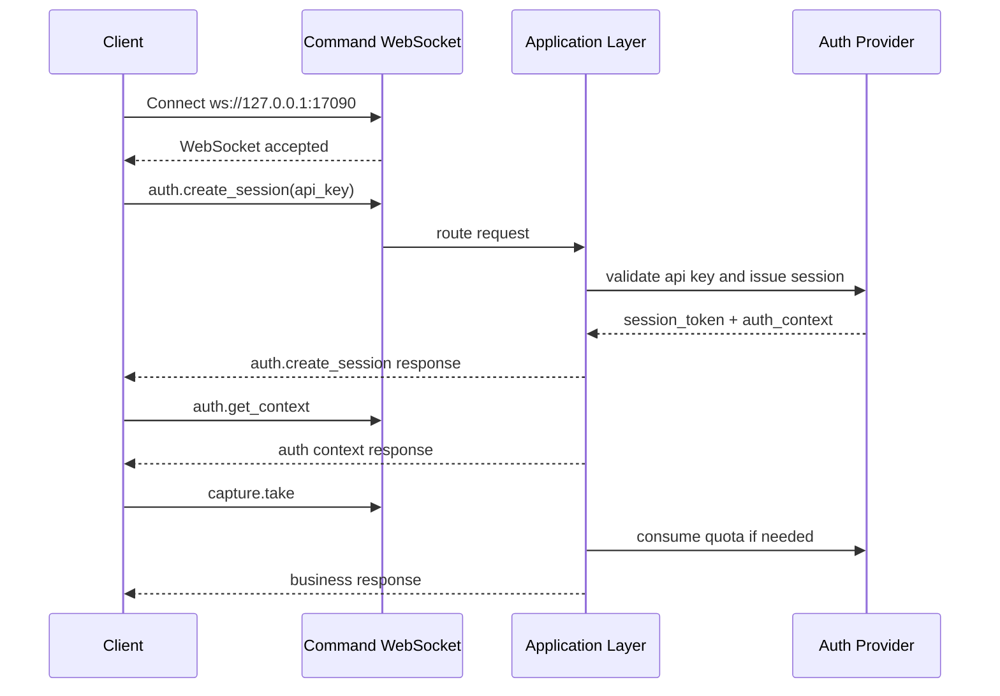

# CZUR Open SDK Command Channel

[中文版本](./COMMAND_CHANNEL_FLOW_ZH.md)

## Overview

This document describes the public command WebSocket flow that is currently implemented in `sdk_open`.

Core rules:

- the command WebSocket is established first
- WebSocket handshake itself stays anonymous
- the long-lived API key is sent through `auth.create_session`
- the server binds the returned `session_token` to the current command connection
- later business requests do not resend auth fields
- offline API keys can be locally unlocked through `auth.activate_offline`
- `capture.take`, `image.process`, and `file.convert` are quota-controlled methods

Default endpoint:

- `ws://127.0.0.1:17090`

## Connection Model

The client first opens the command lane:

```text
ws://127.0.0.1:17090
```

After the socket is ready:

- `system.*` methods can be called directly
- `auth.create_session` validates the API key and issues a connection-bound `session_token`
- `auth.get_context` returns the current `auth_context`
- `auth.activate_offline` upgrades one offline API key from limited mode to unlocked mode on the local machine
- `auth.refresh_session` rotates the session token
- business methods reuse the bound session implicitly

## Request Shape

Unified request format:

```json
{
  "request_id": "req-001",
  "method": "auth.create_session",
  "params": {
    "token": "sk-sq-v1-xxxx"
  },
  "client": {
    "source": "demo-site",
    "protocol_version": "2.0.0",
    "trace_id": "trc-001"
  }
}
```

Notes:

- `request_id` is the only public request identifier
- `method` is the command method
- `params` carries method parameters
- `client` carries optional source and tracing metadata
- requests do not carry `auth.session_key` or `auth.session_token`

## Response Shape

Unified response format:

```json
{
  "request_id": "req-001",
  "code": 0,
  "message": "ok",
  "data": {},
  "ts": 1710000000
}
```

## Event Shape

Server-pushed events stay separate from request/response traffic:

```json
{
  "event": "video.ready",
  "code": 0,
  "message": "ok",
  "payload": {
    "stream_id": "stream-001"
  },
  "ts": 1710000001
}
```

## Auth Flow

### 1. Open the command WebSocket

The socket is opened without embedding the API key in the handshake URL.

### 2. Create a bound session from the API key

```json
{
  "request_id": "req-auth-001",
  "method": "auth.create_session",
  "params": {
    "token": "sk-sq-v1-xxxx"
  }
}
```

Successful response example:

```json
{
  "request_id": "req-auth-001",
  "code": 0,
  "message": "ok",
  "data": {
    "session_token": "ss-v1-xxxx",
    "expires_in": 7200,
    "auth_context": {
      "is_valid": true,
      "account_type": "svip",
      "account_type_code": 1,
      "auth_scene": "plugin",
      "license_mode": "offline_api_key",
      "entitlement_state": "offline_limited",
      "machine_code": "MC-xxxx",
      "device_scope": [
        { "vid": 4660, "pid": 22136 }
      ],
      "capabilities": [
        "system.ping",
        "system.info",
        "system.capabilities",
        "auth.create_session",
        "auth.get_context",
        "auth.refresh_session",
        "auth.activate_offline",
        "auth.destroy_session",
        "capture.take",
        "image.process",
        "file.convert"
      ],
      "quota_buckets": [
        {
          "bucket": "capture",
          "methods": ["capture.take"],
          "limit": 5,
          "remaining": 5,
          "enforcement": "local_quota"
        }
      ]
    }
  },
  "ts": 1710000002
}
```

### 3. Read the current auth context

```json
{
  "request_id": "req-auth-ctx-001",
  "method": "auth.get_context",
  "params": {}
}
```

### 4. Unlock an offline API key on the local machine

Only offline API keys use this step. The client obtains a machine-specific auth code through the private licensing workflow and then calls:

```json
{
  "request_id": "req-auth-offline-001",
  "method": "auth.activate_offline",
  "params": {
    "auth_code": "CZUR-xxxx"
  }
}
```

On success:

- `auth_context.entitlement_state` changes from `offline_limited` to `offline_unlocked`
- a fresh `session_token` is returned immediately
- local quota enforcement for `capture.take`, `image.process`, and `file.convert` stops

### 5. Call business methods

Business requests do not resend the session:

```json
{
  "request_id": "req-capture-001",
  "method": "capture.take",
  "params": {
    "device_id": "device-001"
  }
}
```

The runtime validates:

- connection-bound session existence
- capability membership
- device scope when applicable
- quota consumption for `capture.take`, `image.process`, and `file.convert`

### 6. Refresh or destroy the session

Supported lifecycle methods:

- `auth.refresh_session`
- `auth.destroy_session`

## Offline and Online API Keys

### Offline API key

- license mode: `offline_api_key`
- default state: `offline_limited`
- local machine code is exposed in `auth_context.machine_code`
- `capture.take`, `image.process`, and `file.convert` are locally quota-limited by default
- `auth.activate_offline` upgrades the current key to `offline_unlocked`

### Online API key

- license mode: `online_api_key`
- validation is performed through the configured HTTP auth service
- quota checks for `capture.take`, `image.process`, and `file.convert` are delegated to the same remote auth service
- the current build supports `http://...` online auth endpoints directly

## Access Rules

- `system.*` is anonymous
- `auth.create_session` is anonymous
- `auth.get_context`, `auth.refresh_session`, `auth.activate_offline`, and `auth.destroy_session` require a valid bound session
- all other business methods require a valid bound session by default

Common auth failures:

- `1100`: auth required
- `1101`: API key invalid
- `1102`: API key expired
- `1103`: session token invalid or expired
- `1107`: capability not allowed
- `1108`: offline auth code invalid
- `1109`: online auth service unavailable
- `1110`: usage limit exceeded
- `1111`: offline binding mismatch

## Relation to Video WS

- `device.close`, `video.start`, `video.stop`, and `video.set_format` stay on the command lane
- the video lane is reserved for stream output and stream-related events
- video WebSocket still uses `session_token + stream_id`

Example:

```text
ws://127.0.0.1:17091?session_token=ss-v1-xxxx&stream_id=stream-001
```

## Sequence Example


