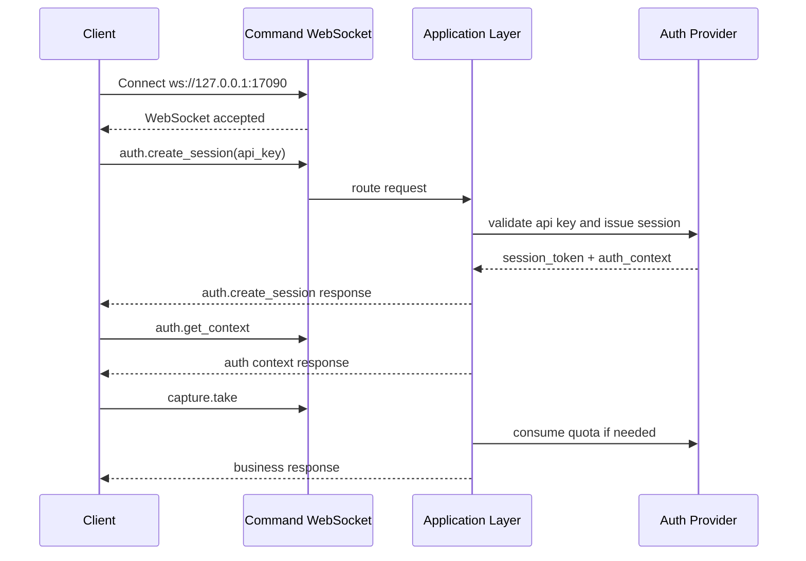

# CZUR Open SDK Command Channel

[中文版本](./COMMAND_CHANNEL_FLOW_ZH.md)

## Overview

This document describes the public command WebSocket flow that is currently implemented in `sdk_open`.

Core rules:

- the command WebSocket is established first
- WebSocket handshake itself stays anonymous
- the long-lived API key is sent through `auth.create_session`
- the server binds the returned `session_token` to the current command connection
- later business requests do not resend auth fields
- offline API keys can be locally unlocked through `auth.activate_offline`
- `capture.take`, `image.process`, `image.process_page`, `image.apply_color_mode`, and `file.convert` are quota-controlled methods

Default endpoint:

- `ws://127.0.0.1:17090`

## Connection Model

The client first opens the command lane:

```text
ws://127.0.0.1:17090
```

After the socket is ready:

- `system.*` methods can be called directly
- `auth.create_session` validates the API key and issues a connection-bound `session_token`
- `auth.get_context` returns the current `auth_context`
- `auth.activate_offline` upgrades one offline API key from limited mode to unlocked mode on the local machine
- `auth.refresh_session` rotates the session token
- business methods reuse the bound session implicitly

## Request Shape

Unified request format:

```json
{
  "request_id": "req-001",
  "method": "auth.create_session",
  "params": {
    "token": "sk-sq-v1-xxxx"
  },
  "client": {
    "source": "demo-site",
    "protocol_version": "2.0.0",
    "trace_id": "trc-001"
  }
}
```

Notes:

- `request_id` is the only public request identifier
- `method` is the command method
- `params` carries method parameters
- `client` carries optional source and tracing metadata
- requests do not carry `auth.session_key` or `auth.session_token`

## Response Shape

Unified response format:

```json
{
  "request_id": "req-001",
  "code": 0,
  "message": "ok",
  "data": {},
  "ts": 1710000000
}
```

## Event Shape

Server-pushed events stay separate from request/response traffic:

```json
{
  "event": "video.ready",
  "code": 0,
  "message": "ok",
  "payload": {
    "stream_id": "stream-001"
  },
  "ts": 1710000001
}
```

## Auth Flow

### 1. Open the command WebSocket

The socket is opened without embedding the API key in the handshake URL.

### 2. Create a bound session from the API key

```json
{
  "request_id": "req-auth-001",
  "method": "auth.create_session",
  "params": {
    "token": "sk-sq-v1-xxxx"
  }
}
```

Successful response example:

```json
{
  "request_id": "req-auth-001",
  "code": 0,
  "message": "ok",
  "data": {
    "session_token": "ss-v1-xxxx",
    "expires_in": 7200,
    "auth_context": {
      "is_valid": true,
      "account_type": "svip",
      "account_type_code": 1,
      "auth_scene": "plugin",
      "license_mode": "offline_api_key",
      "entitlement_state": "offline_limited",
      "machine_code": "MC-xxxx",
      "device_scope": [
        { "vid": 4660, "pid": 22136 }
      ],
      "capabilities": [
        "system.ping",
        "system.info",
        "system.capabilities",
        "auth.create_session",
        "auth.get_context",
        "auth.refresh_session",
        "auth.activate_offline",
        "auth.destroy_session",
        "capture.take",
        "image.process",
        "image.process_page",
        "image.apply_color_mode",
        "file.convert"
      ],
      "quota_buckets": [
        {
          "bucket": "capture",
          "methods": ["capture.take"],
          "limit": 5,
          "remaining": 5,
          "enforcement": "local_quota"
        }
      ]
    }
  },
  "ts": 1710000002
}
```

### 3. Read the current auth context

```json
{
  "request_id": "req-auth-ctx-001",
  "method": "auth.get_context",
  "params": {}
}
```

### 4. Unlock an offline API key on the local machine

Only offline API keys use this step. The client obtains a machine-specific auth code through the private licensing workflow and then calls:

```json
{
  "request_id": "req-auth-offline-001",
  "method": "auth.activate_offline",
  "params": {
    "auth_code": "CZUR-xxxx"
  }
}
```

On success:

- `auth_context.entitlement_state` changes from `offline_limited` to `offline_unlocked`
- a fresh `session_token` is returned immediately
- local quota enforcement for `capture.take`, image-processing methods, and `file.convert` stops

### 5. Call business methods

Business requests do not resend the session:

```json
{
  "request_id": "req-capture-001",
  "method": "capture.take",
  "params": {
    "device_id": "device-001"
  }
}
```

The runtime validates:

- connection-bound session existence
- capability membership
- device scope when applicable
- quota consumption for `capture.take`, image-processing methods, and `file.convert`

Paper processing extension parameters are passed through `params.profile.capture` in capture methods and through top-level `params.single_page` / `params.curved_book` in `image.process` or `image.process_page`. Single-page mode supports:

- `single_page.crop_border.enabled/width/height`: crop-border switch and margins. `width/height` are clamped to `-100..100`.
- `single_page.id_card_round_corner`: ID card rounded-corner padding.
- `single_page.auto_rotate`: automatic page rotation.
- `single_page.smart_black_edge_optimize`: smart black-edge optimization, enabled by default.
- `single_page.multi_target_paging`: multi-target auto paging; may produce multiple page assets.
- `single_page.realtime_detect_rects`: capture/video-flow only. Whether the video stream returns realtime detection boxes. When disabled, the backend does not run per-frame detection.

Curved-book mode supports:

- `curved_book.remove_finger.enabled`: remove-finger switch.
- `curved_book.remove_finger.finger_type`: `with_sleeve` or `without_sleeve`.
- `curved_book.smart_paging`: split into left/right pages; disabled means output one flattened image.
- `curved_book.crop_border.enabled/width/height`: crop-border switch and margins.
- `curved_book.auto_complete`: automatic page completion.

Standalone `image.process` curved-book processing uses edge-based flattening only. Laser-line flattening is only available in the capture flow for supported devices, because it requires device laser calibration data and the laser image captured together with the original image.

`video.set_profile` can update `single_page.realtime_detect_rects` and `single_page.multi_target_paging` at runtime without reopening the video stream.

`image.process` is kept as a compatibility method that runs paper processing, color mode, and format conversion in one call. New integrations should prefer the split methods:

- `image.process_page`: runs only page/paper processing and keeps the source image format.
- `image.apply_color_mode`: runs only color mode processing and keeps the source image format.
- `file.convert`: performs image format conversion, for example JPG to PNG or TIFF.

Compatibility `image.process` example:

```json
{
  "request_id": "req-image-001",
  "method": "image.process",
  "params": {
    "input_upload_id": "img-1760000000-1",
    "output_dir": "/tmp/sdk-demo",
    "page_processing": "single_page",
    "color_mode": "auto_optimize",
    "output_format": "jpg",
    "single_page": {
      "crop_border": { "enabled": false, "width": 0, "height": 0 },
      "auto_rotate": true,
      "smart_black_edge_optimize": true,
      "multi_target_paging": false
    }
  }
}
```

Split page-processing example:

```json
{
  "request_id": "req-page-001",
  "method": "image.process_page",
  "params": {
    "input_upload_id": "img-1760000000-1",
    "page_processing": "single_page",
    "single_page": {
      "crop_border": { "enabled": false, "width": 0, "height": 0 },
      "auto_rotate": true
    }
  }
}
```

Split color-mode example:

```json
{
  "request_id": "req-color-001",
  "method": "image.apply_color_mode",
  "params": {
    "input_upload_id": "img-1760000000-1",
    "color_mode": "grayscale"
  }
}
```

Image format conversion belongs to `file.convert`:

```json
{
  "request_id": "req-convert-001",
  "method": "file.convert",
  "params": {
    "input_upload_id": "img-1760000000-1",
    "output_format": "png"
  }
}
```

The demo site uploads local browser-selected images with `POST /api/uploads/images` on the asset service (`http://127.0.0.1:17082` by default). The request must be multipart form-data with field `file` and `Authorization: Bearer <session_token>`. The response returns `upload_id` and an original image asset. Image methods can use either `input_upload_id` or the existing local `input_path + output_path` mode.

For `selected_area`, pass frontend-scaled points in `params.selected_area.points` and the coordinate basis in `params.selected_area.source.width/height`. The backend scales those points to the real input image size before cropping. The response returns `output_path` for the first page and `outputs[]` for single or multi-page results.

OCR and recognition methods:

- `ocr.extract_text`: runs lightweight OCR on one image and returns text blocks with image-space rectangles.
- `ocr.recognize`: starts an asynchronous OCR export task. It accepts `input_upload_ids` or `input_files`, `output_path` or `output_dir`, `format`, and optional export parameters such as `encoding`, `paperSize`, `exportType`, `ocrPreference`, `quality`, and `exportFormat`. Supported export formats are `txt`, `pdf`, `docx`, `xlsx`, `ofd`, and `json`.
- `ocr.get`: returns the current OCR task snapshot.
- `ocr.cancel`: requests cancellation of one OCR task.
- `recognition.barcode_detect`: detects barcode/QR content from one static image. Realtime barcode recognition belongs to the capture/video flow and is not started by this method.

OCR text extraction example:

```json
{
  "request_id": "req-ocr-text-001",
  "method": "ocr.extract_text",
  "params": {
    "input_upload_id": "img-1760000000-1"
  }
}
```

OCR export example:

```json
{
  "request_id": "req-ocr-001",
  "method": "ocr.recognize",
  "params": {
    "input_upload_ids": ["img-1760000000-1", "img-1760000000-2"],
    "output_path": "/tmp/demo.txt",
    "format": "txt",
    "exportType": "multi-page",
    "encoding": "utf-8",
    "quality": 90
  }
}
```

Use `exportType: "single-page"` with `output_dir` to export one file per input image. The response includes `data.output_paths` and `data.task.output_paths`.

OCR task query/cancel examples:

```json
{ "request_id": "req-ocr-get-001", "method": "ocr.get", "params": { "task_id": "ocr-1" } }
{ "request_id": "req-ocr-cancel-001", "method": "ocr.cancel", "params": { "task_id": "ocr-1" } }
```

Barcode detection example:

```json
{
  "request_id": "req-barcode-001",
  "method": "recognition.barcode_detect",
  "params": {
    "input_upload_id": "img-1760000000-1",
    "formats": ["qrcode", "pdf417", "code128"]
  }
}
```

### 6. Refresh or destroy the session

Supported lifecycle methods:

- `auth.refresh_session`
- `auth.destroy_session`

## Offline and Online API Keys

### Offline API key

- license mode: `offline_api_key`
- default state: `offline_limited`
- local machine code is exposed in `auth_context.machine_code`
- `capture.take`, image-processing methods, and `file.convert` are locally quota-limited by default
- `auth.activate_offline` upgrades the current key to `offline_unlocked`

### Online API key

- license mode: `online_api_key`
- validation is performed through the configured HTTP auth service
- quota checks for `capture.take`, image-processing methods, and `file.convert` are delegated to the same remote auth service
- the current build supports `http://...` online auth endpoints directly

## Access Rules

- `system.*` is anonymous
- `auth.create_session` is anonymous
- `auth.get_context`, `auth.refresh_session`, `auth.activate_offline`, and `auth.destroy_session` require a valid bound session
- all other business methods require a valid bound session by default

Common auth failures:

- `1100`: auth required
- `1101`: API key invalid
- `1102`: API key expired
- `1103`: session token invalid or expired
- `1107`: capability not allowed
- `1108`: offline auth code invalid
- `1109`: online auth service unavailable
- `1110`: usage limit exceeded
- `1111`: offline binding mismatch

## Relation to Video WS

- `device.close`, `video.start`, `video.stop`, and `video.set_format` stay on the command lane
- the video lane is reserved for stream output and stream-related events
- video WebSocket still uses `session_token + stream_id`

Example:

```text
ws://127.0.0.1:17091?session_token=ss-v1-xxxx&stream_id=stream-001
```

## Sequence Example


