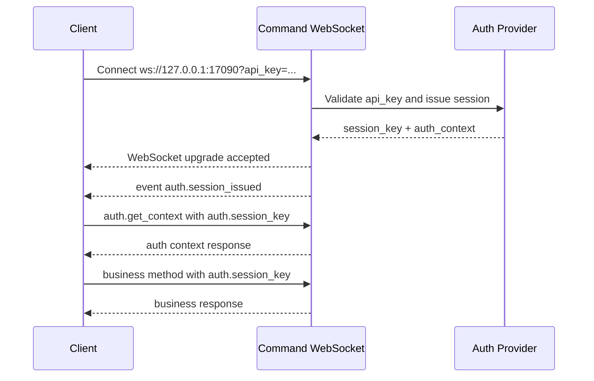

# CZUR Open SDK Command Channel Flow

[中文版本](./COMMAND_CHANNEL_FLOW_ZH.md)

## Overview

This document describes the public connection flow and communication model of the `sdk_open` command channel.

Current scope:

- This document covers only the command WebSocket channel.
- It does not describe the video WebSocket channel yet.
- The goal is to help external integrators understand how to connect, authenticate, bootstrap a session, and send follow-up commands.

Default endpoint:

- command channel: `ws://127.0.0.1:17090`

## Connection Establishment

The command channel is established through a WebSocket handshake with an `api_key` query parameter.

Example:

```text
ws://127.0.0.1:17090?api_key=<your-api-key>
```

Handshake behavior:

1. The client opens the WebSocket with `?api_key=...`.
2. The server validates the `api_key` during the handshake.
3. If validation succeeds, the WebSocket upgrade is accepted.
4. If validation fails, the handshake is rejected with HTTP `401`.

Handshake failure body shape:

```json
{
  "code": 1101,
  "message": "api key invalid",
  "data": {}
}
```

Notes:

- `api_key` is used only for initial handshake admission and session issuance.
- The command channel accepts text JSON messages only.

## Bootstrap Sequence

After the WebSocket handshake succeeds, the server actively pushes the first system event:

- `auth.session_issued`

This event bootstraps the session for the current command connection. The client should cache the returned `session_key` and use it for follow-up business commands.

Example event:

```json
{
  "event": "auth.session_issued",
  "code": 0,
  "message": "ok",
  "payload": {
    "session_key": "ss-v1-xxxxxxxx",
    "session_token": "ss-v1-xxxxxxxx",
    "expires_in": 7200,
    "auth_context": {
      "is_valid": true,
      "account_type": "svip",
      "account_type_code": 1,
      "auth_scene": "plugin",
      "license_mode": "offline_api_key",
      "device_scope": [
        { "vid": 4660, "pid": 22136 }
      ],
      "expires_at": 0,
      "capabilities": [
        "system.ping",
        "system.info",
        "system.capabilities",
        "auth.validate",
        "auth.refresh",
        "auth.get_context",
        "device.list"
      ]
    }
  },
  "ts": 1710000000
}
```

Field notes:

- `session_key` is the primary public field name.
- `session_token` is currently kept as a compatibility alias.
- `expires_in` is the session TTL in seconds.
- `auth_context` contains account tier, granted device scope, and capability list.

## Message Model

### Request shape

Command requests use the following JSON shape:

```json
{
  "request_id": "req-001",
  "method": "device.list",
  "params": {},
  "auth": {
    "session_key": "ss-v1-xxxxxxxx"
  },
  "client": {
    "source": "demo-site",
    "protocol_version": "1.0.0",
    "trace_id": "trc-001"
  }
}
```

Compatibility notes:

- `id` may still be accepted as a legacy alias of `request_id`.
- `auth.session_token` may still be accepted as a compatibility alias of `auth.session_key`.

### Response shape

Command responses use the following JSON shape:

```json
{
  "code": 0,
  "message": "ok",
  "data": {
    "devices": ["mock-device-01"],
    "count": 1
  },
  "request_id": "req-001",
  "id": "req-001",
  "ts": 1710000001
}
```

### Event shape

Server-pushed events use the following JSON shape:

```json
{
  "event": "auth.session_issued",
  "code": 0,
  "message": "ok",
  "payload": {},
  "ts": 1710000000
}
```

## Authorization Rules

The command channel uses a two-stage authorization model.

### Stage 1: handshake admission

- The client provides `api_key` in the WebSocket URL query.
- The server validates the `api_key`.
- If validation succeeds, the connection is upgraded and a session is issued.

### Stage 2: command authorization

- `system.*` methods can be called without `session_key`.
- `auth.validate`, `auth.refresh`, and `auth.get_context` remain available for auth-related operations.
- Business methods outside `system.*` and `auth.*` must provide `auth.session_key`.
- The server first validates `session_key`, then checks whether the session grants the requested capability.

Typical failures:

- `1100`: auth required or session key required
- `1101`: api key invalid
- `1103`: session token invalid
- `1107`: capability not allowed

See also:

- [ERROR_CODES.md](./ERROR_CODES.md)

## Supported Method Domains

Current command channel method domains include:

- `system.*`
- `auth.*`
- `device.*`
- `capture.*`
- `image.*`
- `ocr.*`
- `file.*`
- `recognition.*`

Important note:

- Some business methods are already wired into the unified session-auth path but still act as placeholder or adapter implementations in the current runtime.
- External integrators should treat the auth flow and wire format as stable, while concrete business capability depth may continue to evolve.

## Sequence Example



## Minimal Examples

### Minimal anonymous command

```json
{
  "request_id": "req-ping-001",
  "method": "system.ping",
  "params": {},
  "auth": {},
  "client": {}
}
```

### Minimal auth context query

```json
{
  "request_id": "req-auth-ctx-001",
  "method": "auth.get_context",
  "params": {},
  "auth": {
    "session_key": "ss-v1-xxxxxxxx"
  },
  "client": {}
}
```

### Minimal business request

```json
{
  "request_id": "req-device-list-001",
  "method": "device.list",
  "params": {},
  "auth": {
    "session_key": "ss-v1-xxxxxxxx"
  },
  "client": {}
}
```

## Documentation Links

- Chinese version: [COMMAND_CHANNEL_FLOW_ZH.md](./COMMAND_CHANNEL_FLOW_ZH.md)
- Public error codes: [ERROR_CODES.md](./ERROR_CODES.md)
- Main project guide: [../README.md](../README.md)
