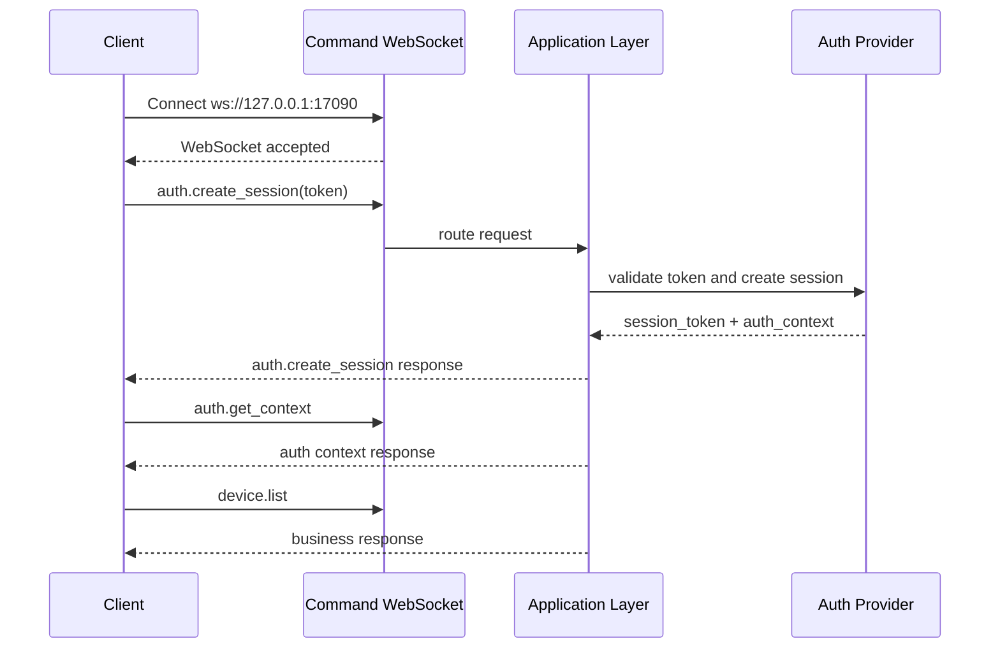

# CZUR Open SDK Command Channel

[中文版本](./COMMAND_CHANNEL_FLOW_ZH.md)

## Overview

This document describes the final public command WebSocket model used by `sdk_open`.

Core rules:

- command WS connects anonymously
- the business token is not passed in the WebSocket handshake query
- all requests use only `request_id`
- business requests no longer carry an explicit `auth` object
- session state is bound by the server to the command connection

Default endpoint:

- `ws://127.0.0.1:17090`

## Connection Model

The client first opens an anonymous WebSocket:

```text
ws://127.0.0.1:17090
```

After the connection is established:

- `system.*` can be called directly
- `auth.create_session` uses a `token` to create a connection-bound session
- later `device.*`, `capture.*`, `video.*`, `image.*`, `ocr.*`, and `file.*` calls reuse that bound session

## Request Shape

Unified request shape:

```json
{
  "request_id": "req-001",
  "method": "auth.create_session",
  "params": {
    "token": "demo-token-42F8"
  },
  "client": {
    "source": "demo-site",
    "protocol_version": "2.0.0",
    "trace_id": "trc-001"
  }
}
```

Notes:

- `request_id` is the only request identifier
- `method` is the public method name
- `params` carries method parameters
- `client` carries source, protocol version, and trace metadata
- `id` is no longer used
- `auth.session_key` and `auth.session_token` are no longer request fields

## Response Shape

Unified response shape:

```json
{
  "request_id": "req-001",
  "code": 0,
  "message": "ok",
  "data": {},
  "ts": 1710000000
}
```

Notes:

- `code` uses the public SDK status codes
- `data` carries the method result
- `ts` is the server timestamp

## Event Shape

Server-pushed event shape:

```json
{
  "event": "video.ready",
  "code": 0,
  "message": "ok",
  "payload": {
    "stream_id": "stream-001"
  },
  "ts": 1710000001
}
```

Events are separate from request/response traffic and do not carry `request_id`.

## Auth Flow

### 1. Anonymous connection

The client opens the command WebSocket without a token.

### 2. Create a bound session

The client sends:

```json
{
  "request_id": "req-auth-001",
  "method": "auth.create_session",
  "params": {
    "token": "demo-token-42F8"
  },
  "client": {
    "source": "demo-site",
    "protocol_version": "2.0.0",
    "trace_id": "trc-auth-001"
  }
}
```

Successful response example:

```json
{
  "request_id": "req-auth-001",
  "code": 0,
  "message": "ok",
  "data": {
    "session_token": "ss-v2-xxxx",
    "expires_in": 7200,
    "auth_context": {
      "is_valid": true,
      "account_type": "sdk_demo_basic",
      "auth_scene": "plugin",
      "license_mode": "offline_token",
      "device_scope": [
        { "vid": 4660, "pid": 22136 }
      ],
      "capabilities": [
        "system.ping",
        "system.info",
        "system.capabilities",
        "auth.create_session",
        "auth.get_context",
        "auth.refresh_session",
        "auth.destroy_session",
        "device.list",
        "device.get",
        "device.open",
        "capture.take",
        "video.start",
        "video.stop",
        "video.set_format",
        "image.process",
        "ocr.recognize",
        "file.convert"
      ]
    }
  },
  "ts": 1710000002
}
```

### 3. Read the current auth context

```json
{
  "request_id": "req-auth-ctx-001",
  "method": "auth.get_context",
  "params": {},
  "client": {
    "source": "demo-site",
    "protocol_version": "2.0.0",
    "trace_id": "trc-auth-ctx-001"
  }
}
```

### 4. Call business methods

Business methods do not resend the session:

```json
{
  "request_id": "req-device-list-001",
  "method": "device.list",
  "params": {},
  "client": {
    "source": "demo-site",
    "protocol_version": "2.0.0",
    "trace_id": "trc-device-001"
  }
}
```

### 5. Refresh or destroy the session

Supported auth lifecycle methods:

- `auth.refresh_session`
- `auth.destroy_session`

## Access Rules

- `system.*` is anonymous
- `auth.create_session` is anonymous
- `auth.get_context`, `auth.refresh_session`, and `auth.destroy_session` require a valid bound session
- all other business methods require a valid bound session by default
- capability and device-scope checks are enforced in the application layer

Common auth failures:

- `1100`: auth required
- `1101`: `token` invalid
- `1102`: `token` expired
- `1103`: bound `session_token` invalid or expired
- `1107`: capability not granted

## Relation to Video WS

- `video.start`, `video.stop`, and `video.set_format` are command-WS methods
- video WS is reserved for frame output and related events
- video WS connects with `session_token + stream_id`

Example:

```text
ws://127.0.0.1:17091?session_token=ss-v2-xxxx&stream_id=stream-001
```

## Sequence Example



## Documentation Links

- Target architecture: [RUNTIME_ARCHITECTURE_ZH.md](./RUNTIME_ARCHITECTURE_ZH.md)
- Error codes: [ERROR_CODES.md](./ERROR_CODES.md)
- Main README: [../README.md](../README.md)
