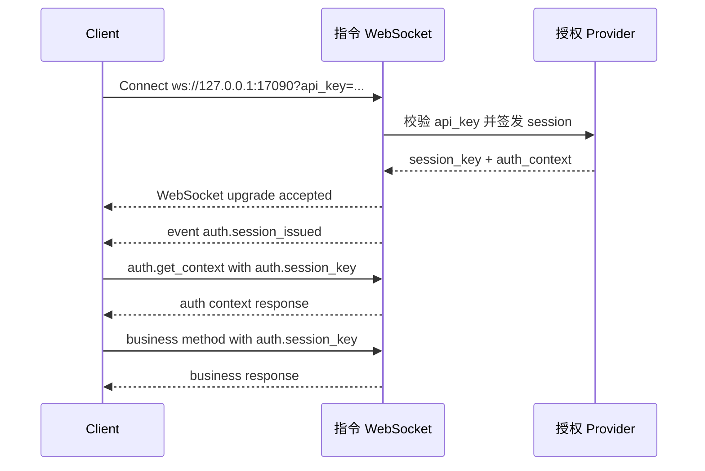

# CZUR Open SDK 指令通道时序说明

[English version](./COMMAND_CHANNEL_FLOW.md)

## 概述

本文档描述 `sdk_open` 指令通道的对外连接方式、建立时序和后续通信模型。

当前范围：

- 本文档只覆盖 command WebSocket channel。
- 当前不包含 video WebSocket channel 的建立过程和协议说明。
- 目标是帮助外部接入方理解如何建立连接、完成授权、获取会话，并继续发送后续指令。

默认地址：

- 指令通道：`ws://127.0.0.1:17090`

## 连接建立

指令通道通过带 `api_key` query 参数的 WebSocket 握手建立。

示例：

```text
ws://127.0.0.1:17090?api_key=<your-api-key>
```

握手行为如下：

1. 客户端通过 `?api_key=...` 发起 WebSocket 连接。
2. 服务端在握手阶段校验 `api_key`。
3. 校验成功后，接受 WebSocket upgrade。
4. 校验失败时，直接拒绝握手并返回 HTTP `401`。

握手失败 body 结构：

```json
{
  "code": 1101,
  "message": "api key invalid",
  "data": {}
}
```

说明：

- `api_key` 只用于首次握手放行和 session 签发。
- 指令通道只接受文本 JSON 消息，不接受二进制请求。

## 启动时序

WebSocket 握手成功后，服务端会主动下发第一条系统事件：

- `auth.session_issued`

这条事件用于为当前指令连接完成 session bootstrap。客户端应缓存返回的 `session_key`，并在后续业务指令中优先使用它。

事件示例：

```json
{
  "event": "auth.session_issued",
  "code": 0,
  "message": "ok",
  "payload": {
    "session_key": "ss-v1-xxxxxxxx",
    "session_token": "ss-v1-xxxxxxxx",
    "expires_in": 7200,
    "auth_context": {
      "is_valid": true,
      "account_type": "svip",
      "account_type_code": 1,
      "auth_scene": "plugin",
      "license_mode": "offline_api_key",
      "device_scope": [
        { "vid": 4660, "pid": 22136 }
      ],
      "expires_at": 0,
      "capabilities": [
        "system.ping",
        "system.info",
        "system.capabilities",
        "auth.validate",
        "auth.refresh",
        "auth.get_context",
        "device.list"
      ]
    }
  },
  "ts": 1710000000
}
```

字段说明：

- `session_key` 是当前对外主字段名。
- `session_token` 当前保留为兼容别名。
- `expires_in` 是 session 的有效时长，单位为秒。
- `auth_context` 包含账号等级、授权设备范围和 capability 列表。

## 消息模型

### 请求结构

指令请求统一使用如下 JSON 结构：

```json
{
  "request_id": "req-001",
  "method": "device.list",
  "params": {},
  "auth": {
    "session_key": "ss-v1-xxxxxxxx"
  },
  "client": {
    "source": "demo-site",
    "protocol_version": "1.0.0",
    "trace_id": "trc-001"
  }
}
```

兼容性说明：

- `id` 目前仍可作为 `request_id` 的兼容别名。
- `auth.session_token` 目前仍可作为 `auth.session_key` 的兼容别名。

### 响应结构

指令响应统一使用如下 JSON 结构：

```json
{
  "code": 0,
  "message": "ok",
  "data": {
    "devices": ["mock-device-01"],
    "count": 1
  },
  "request_id": "req-001",
  "id": "req-001",
  "ts": 1710000001
}
```

### 事件结构

服务端主动事件统一使用如下 JSON 结构：

```json
{
  "event": "auth.session_issued",
  "code": 0,
  "message": "ok",
  "payload": {},
  "ts": 1710000000
}
```

## 授权规则

指令通道采用“两段式”授权模型。

### 第一阶段：握手放行

- 客户端在 WebSocket URL query 中传入 `api_key`。
- 服务端校验 `api_key`。
- 校验通过后，连接升级成功，并为该连接签发 session。

### 第二阶段：指令鉴权

- `system.*` 方法可匿名调用，不要求 `session_key`。
- `auth.validate`、`auth.refresh`、`auth.get_context` 继续保留给授权相关场景使用。
- 非 `system.*` 和 `auth.*` 的业务方法，必须传入 `auth.session_key`。
- 服务端会先校验 `session_key`，再判断该 session 是否具备访问当前 method 的 capability。

常见失败码：

- `1100`：需要认证，或缺少 `session_key`
- `1101`：`api_key` 非法
- `1103`：`session_key` 非法或已失效
- `1107`：当前 session 不具备目标 capability

另见：

- [ERROR_CODES_ZH.md](./ERROR_CODES_ZH.md)

## 当前开放的方法域

当前指令通道已开放的方法域包括：

- `system.*`
- `auth.*`
- `device.*`
- `capture.*`
- `image.*`
- `ocr.*`
- `file.*`
- `recognition.*`

重要说明：

- 当前部分业务 method 已经接入统一的 session 授权链路，但底层能力仍是占位实现或适配实现。
- 外部接入时，应把授权流程和协议结构视为稳定接口；具体业务能力深度仍会继续演进。

## 时序示例



## 最小示例

### 最小匿名指令

```json
{
  "request_id": "req-ping-001",
  "method": "system.ping",
  "params": {},
  "auth": {},
  "client": {}
}
```

### 最小授权上下文查询

```json
{
  "request_id": "req-auth-ctx-001",
  "method": "auth.get_context",
  "params": {},
  "auth": {
    "session_key": "ss-v1-xxxxxxxx"
  },
  "client": {}
}
```

### 最小业务请求

```json
{
  "request_id": "req-device-list-001",
  "method": "device.list",
  "params": {},
  "auth": {
    "session_key": "ss-v1-xxxxxxxx"
  },
  "client": {}
}
```

## 文档链接

- 英文版本：[COMMAND_CHANNEL_FLOW.md](./COMMAND_CHANNEL_FLOW.md)
- 错误码文档：[ERROR_CODES_ZH.md](./ERROR_CODES_ZH.md)
- 主项目说明：[../README_ZH.md](../README_ZH.md)
