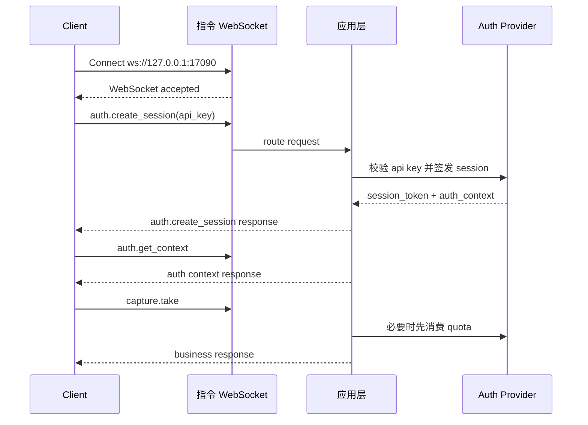

# CZUR Open SDK 指令通道说明

[English version](./COMMAND_CHANNEL_FLOW.md)

## 概述

本文档描述 `sdk_open` 当前已经实现的 command WebSocket 建连与通信逻辑。

核心规则：

- 先建立指令 WebSocket
- WebSocket 握手本身保持匿名
- 长效 API Key 通过 `auth.create_session` 发送给服务端
- 服务端把返回的 `session_token` 绑定到当前指令连接
- 后续业务请求不再重复携带鉴权字段
- 离线 API Key 可通过 `auth.activate_offline` 在本机解封
- `capture.take`、`image.process`、`file.convert` 三个方法带 quota 控制

默认地址：

- `ws://127.0.0.1:17090`

## 建连模型

客户端先建立指令通道：

```text
ws://127.0.0.1:17090
```

连接建立后：

- `system.*` 可直接调用
- `auth.create_session` 校验 API Key 并签发连接绑定的 `session_token`
- `auth.get_context` 返回当前 `auth_context`
- `auth.activate_offline` 可把一个离线 API Key 从受限状态升级为本机解封状态
- `auth.refresh_session` 用于轮换会话 token
- 业务方法默认复用当前连接绑定的会话

## 请求模型

统一请求结构：

```json
{
  "request_id": "req-001",
  "method": "auth.create_session",
  "params": {
    "token": "sk-sq-v1-xxxx"
  },
  "client": {
    "source": "demo-site",
    "protocol_version": "2.0.0",
    "trace_id": "trc-001"
  }
}
```

说明：

- `request_id` 是唯一公开请求标识
- `method` 是方法名
- `params` 是方法参数
- `client` 是可选的来源与 tracing 信息
- 请求体不再携带 `auth.session_key` 或 `auth.session_token`

## 响应模型

统一响应结构：

```json
{
  "request_id": "req-001",
  "code": 0,
  "message": "ok",
  "data": {},
  "ts": 1710000000
}
```

## 事件模型

服务端主动事件与请求响应分离：

```json
{
  "event": "video.ready",
  "code": 0,
  "message": "ok",
  "payload": {
    "stream_id": "stream-001"
  },
  "ts": 1710000001
}
```

## 授权流程

### 1. 建立指令通道

客户端连接 command WebSocket，不在握手 URL 中塞 API Key。

### 2. 使用 API Key 创建连接绑定会话

```json
{
  "request_id": "req-auth-001",
  "method": "auth.create_session",
  "params": {
    "token": "sk-sq-v1-xxxx"
  }
}
```

成功响应示例：

```json
{
  "request_id": "req-auth-001",
  "code": 0,
  "message": "ok",
  "data": {
    "session_token": "ss-v1-xxxx",
    "expires_in": 7200,
    "auth_context": {
      "is_valid": true,
      "account_type": "svip",
      "account_type_code": 1,
      "auth_scene": "plugin",
      "license_mode": "offline_api_key",
      "entitlement_state": "offline_limited",
      "machine_code": "MC-xxxx",
      "device_scope": [
        { "vid": 4660, "pid": 22136 }
      ],
      "capabilities": [
        "system.ping",
        "system.info",
        "system.capabilities",
        "auth.create_session",
        "auth.get_context",
        "auth.refresh_session",
        "auth.activate_offline",
        "auth.destroy_session",
        "capture.take",
        "image.process",
        "file.convert"
      ],
      "quota_buckets": [
        {
          "bucket": "capture",
          "methods": ["capture.take"],
          "limit": 5,
          "remaining": 5,
          "enforcement": "local_quota"
        }
      ]
    }
  },
  "ts": 1710000002
}
```

### 3. 读取当前会话上下文

```json
{
  "request_id": "req-auth-ctx-001",
  "method": "auth.get_context",
  "params": {}
}
```

### 4. 在本机解封离线 API Key

只有离线 API Key 需要这一步。客户端先走私有授权流程拿到与当前机器码对应的授权码，然后调用：

```json
{
  "request_id": "req-auth-offline-001",
  "method": "auth.activate_offline",
  "params": {
    "auth_code": "CZUR-xxxx"
  }
}
```

成功后：

- `auth_context.entitlement_state` 会从 `offline_limited` 切到 `offline_unlocked`
- 服务端会立即返回新的 `session_token`
- `capture.take`、`image.process`、`file.convert` 的本地 quota 限制停止生效

### 5. 调用业务方法

业务请求不再重复传 session：

```json
{
  "request_id": "req-capture-001",
  "method": "capture.take",
  "params": {
    "device_id": "device-001"
  }
}
```

运行时会依次校验：

- 当前连接是否已绑定合法会话
- 当前 capability 是否允许
- 设备 scope 是否允许
- `capture.take`、`image.process`、`file.convert` 是否还能继续消费 quota

### 6. 刷新或销毁会话

支持的方法：

- `auth.refresh_session`
- `auth.destroy_session`

## 离线与在线 API Key

### 离线 API Key

- `license_mode` 为 `offline_api_key`
- 默认状态为 `offline_limited`
- 当前机器码会通过 `auth_context.machine_code` 返回
- `capture.take`、`image.process`、`file.convert` 默认走本地 quota 限制
- `auth.activate_offline` 成功后状态切为 `offline_unlocked`

### 在线 API Key

- `license_mode` 为 `online_api_key`
- 创建会话时会调用配置的 HTTP 授权服务
- `capture.take`、`image.process`、`file.convert` 每次调用前都会走远端 quota 校验
- 当前实现直接支持 `http://...` 在线授权地址

## 访问规则

- `system.*` 可匿名调用
- `auth.create_session` 可匿名调用
- `auth.get_context`、`auth.refresh_session`、`auth.activate_offline`、`auth.destroy_session` 需要当前连接已有合法会话
- 其他业务方法默认都要求当前连接已有合法会话

常见失败码：

- `1100`：需要认证
- `1101`：API Key 非法
- `1102`：API Key 已过期
- `1103`：`session_token` 非法或已过期
- `1107`：当前会话不具备目标 capability
- `1108`：离线授权码非法
- `1109`：在线授权服务不可用
- `1110`：配额已耗尽
- `1111`：离线授权码与当前机器不匹配

## 与 Video WS 的关系

- `video.start`、`video.stop`、`video.set_format` 仍然走 command WS
- video WS 只负责视频帧输出和流相关事件
- video WS 使用 `session_token + stream_id` 建连

示例：

```text
ws://127.0.0.1:17091?session_token=ss-v1-xxxx&stream_id=stream-001
```

## 时序示例


