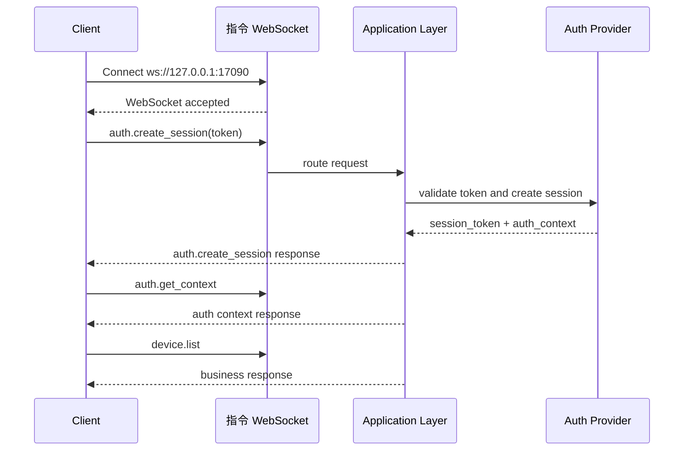

# CZUR Open SDK 指令通道说明

[English version](./COMMAND_CHANNEL_FLOW.md)

## 概述

本文档描述 `sdk_open` 最终对外 command WebSocket 模型。

关键规则：

- command WS 匿名建连
- 业务 token 不出现在 WebSocket 握手 query 中
- 所有请求只使用 `request_id`
- 业务请求不再显式携带 `auth` 对象
- 会话状态由服务端绑定到 command 连接

默认地址：

- `ws://127.0.0.1:17090`

## 建连模型

客户端先建立匿名 WebSocket 连接：

```text
ws://127.0.0.1:17090
```

连接建立后：

- `system.*` 可以直接调用
- `auth.create_session` 使用 `token` 创建连接绑定会话
- 后续 `device.*`、`capture.*`、`video.*`、`image.*`、`ocr.*`、`file.*` 复用当前连接绑定的会话

## 请求模型

统一请求结构：

```json
{
  "request_id": "req-001",
  "method": "auth.create_session",
  "params": {
    "token": "demo-token-42F8"
  },
  "client": {
    "source": "demo-site",
    "protocol_version": "2.0.0",
    "trace_id": "trc-001"
  }
}
```

说明：

- `request_id` 是唯一请求标识
- `method` 是公开方法名
- `params` 是方法参数
- `client` 用于来源、协议版本和 trace 信息
- 不再使用 `id`
- 不再使用 `auth.session_key` 或 `auth.session_token` 请求字段

## 响应模型

统一响应结构：

```json
{
  "request_id": "req-001",
  "code": 0,
  "message": "ok",
  "data": {},
  "ts": 1710000000
}
```

说明：

- `code` 使用公开错误码
- `data` 承载方法结果
- `ts` 是服务端时间戳

## 事件模型

服务端主动事件结构：

```json
{
  "event": "video.ready",
  "code": 0,
  "message": "ok",
  "payload": {
    "stream_id": "stream-001"
  },
  "ts": 1710000001
}
```

说明：

- 事件和请求响应分离
- 事件不带 `request_id`

## 授权流程

### 1. 匿名连接

客户端建立 command WS 连接，不带 token。

### 2. 创建连接绑定会话

客户端发送：

```json
{
  "request_id": "req-auth-001",
  "method": "auth.create_session",
  "params": {
    "token": "demo-token-42F8"
  },
  "client": {
    "source": "demo-site",
    "protocol_version": "2.0.0",
    "trace_id": "trc-auth-001"
  }
}
```

成功响应示例：

```json
{
  "request_id": "req-auth-001",
  "code": 0,
  "message": "ok",
  "data": {
    "session_token": "ss-v2-xxxx",
    "expires_in": 7200,
    "auth_context": {
      "is_valid": true,
      "account_type": "sdk_demo_basic",
      "auth_scene": "plugin",
      "license_mode": "offline_token",
      "device_scope": [
        { "vid": 4660, "pid": 22136 }
      ],
      "capabilities": [
        "system.ping",
        "system.info",
        "system.capabilities",
        "auth.create_session",
        "auth.get_context",
        "auth.refresh_session",
        "auth.destroy_session",
        "device.list",
        "device.get",
        "device.open",
        "capture.take",
        "video.start",
        "video.stop",
        "video.set_format",
        "image.process",
        "ocr.recognize",
        "file.convert"
      ]
    }
  },
  "ts": 1710000002
}
```

### 3. 读取当前会话上下文

```json
{
  "request_id": "req-auth-ctx-001",
  "method": "auth.get_context",
  "params": {},
  "client": {
    "source": "demo-site",
    "protocol_version": "2.0.0",
    "trace_id": "trc-auth-ctx-001"
  }
}
```

### 4. 调用业务方法

业务请求不再重复传 session：

```json
{
  "request_id": "req-device-list-001",
  "method": "device.list",
  "params": {},
  "client": {
    "source": "demo-site",
    "protocol_version": "2.0.0",
    "trace_id": "trc-device-001"
  }
}
```

### 5. 刷新或销毁会话

支持的方法：

- `auth.refresh_session`
- `auth.destroy_session`

## 访问规则

- `system.*` 可匿名调用
- `auth.create_session` 可匿名调用
- `auth.get_context`、`auth.refresh_session`、`auth.destroy_session` 需要当前连接已绑定合法会话
- 其余业务方法默认都要求当前连接已绑定合法会话
- 应用层统一执行 capability 和 device scope 判定

常见失败码：

- `1100`：当前方法需要认证
- `1101`：`token` 非法
- `1102`：`token` 已过期
- `1103`：当前连接绑定的 `session_token` 非法或已过期
- `1107`：当前会话不具备目标 capability

## 与 Video WS 的关系

- `video.start`、`video.stop`、`video.set_format` 都走 command WS
- video WS 只负责视频帧输出与相关事件
- video WS 使用 `session_token + stream_id` 建连

示例：

```text
ws://127.0.0.1:17091?session_token=ss-v2-xxxx&stream_id=stream-001
```

## 时序示例



## 文档链接

- 目标架构说明：[RUNTIME_ARCHITECTURE_ZH.md](./RUNTIME_ARCHITECTURE_ZH.md)
- 错误码说明：[ERROR_CODES_ZH.md](./ERROR_CODES_ZH.md)
- 主项目说明：[../README_ZH.md](../README_ZH.md)
