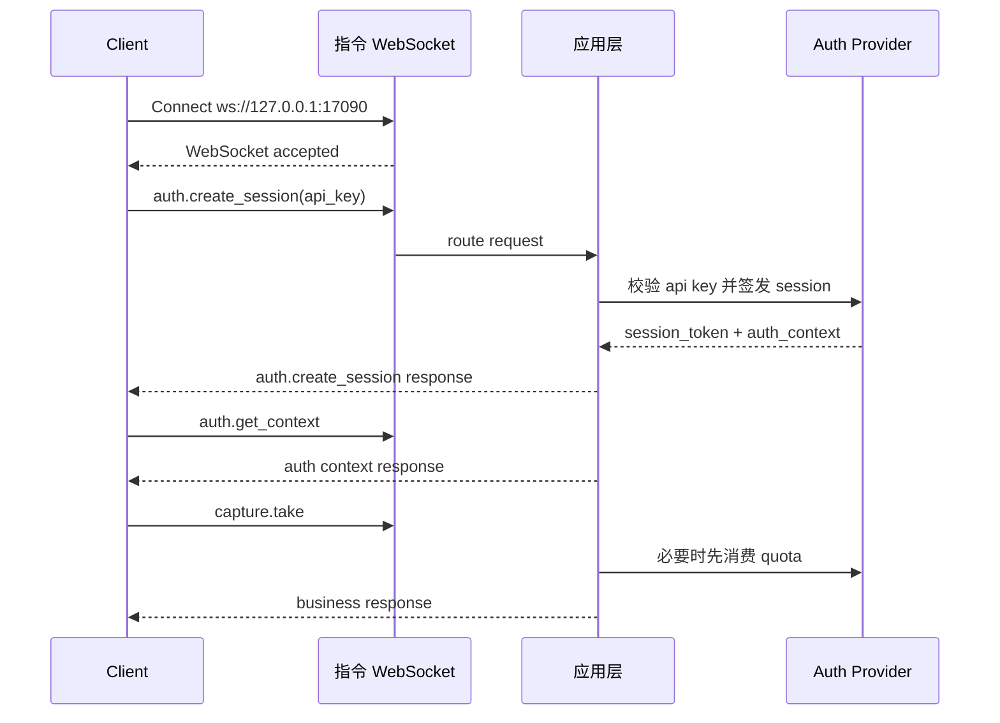

# CZUR Open SDK 指令通道说明

[English version](./COMMAND_CHANNEL_FLOW.md)

## 概述

本文档描述 `sdk_open` 当前已经实现的 command WebSocket 建连与通信逻辑。

核心规则：

- 先建立指令 WebSocket
- WebSocket 握手本身保持匿名
- 长效 API Key 通过 `auth.create_session` 发送给服务端
- 服务端把返回的 `session_token` 绑定到当前指令连接
- 后续业务请求不再重复携带鉴权字段
- 离线 API Key 可通过 `auth.activate_offline` 在本机解封
- `capture.take`、`image.process`、`image.process_page`、`image.apply_color_mode`、`file.convert` 带 quota 控制

默认地址：

- `ws://127.0.0.1:17090`

## 建连模型

客户端先建立指令通道：

```text
ws://127.0.0.1:17090
```

连接建立后：

- `system.*` 可直接调用
- `auth.create_session` 校验 API Key 并签发连接绑定的 `session_token`
- `auth.get_context` 返回当前 `auth_context`
- `auth.activate_offline` 可把一个离线 API Key 从受限状态升级为本机解封状态
- `auth.refresh_session` 用于轮换会话 token
- 业务方法默认复用当前连接绑定的会话

## 请求模型

统一请求结构：

```json
{
  "request_id": "req-001",
  "method": "auth.create_session",
  "params": {
    "token": "sk-sq-v1-xxxx"
  },
  "client": {
    "source": "demo-site",
    "protocol_version": "2.0.0",
    "trace_id": "trc-001"
  }
}
```

说明：

- `request_id` 是唯一公开请求标识
- `method` 是方法名
- `params` 是方法参数
- `client` 是可选的来源与 tracing 信息
- 请求体不再携带 `auth.session_key` 或 `auth.session_token`

## 响应模型

统一响应结构：

```json
{
  "request_id": "req-001",
  "code": 0,
  "message": "ok",
  "data": {},
  "ts": 1710000000
}
```

## 事件模型

服务端主动事件与请求响应分离：

```json
{
  "event": "video.ready",
  "code": 0,
  "message": "ok",
  "payload": {
    "stream_id": "stream-001"
  },
  "ts": 1710000001
}
```

## 授权流程

### 1. 建立指令通道

客户端连接 command WebSocket，不在握手 URL 中塞 API Key。

### 2. 使用 API Key 创建连接绑定会话

```json
{
  "request_id": "req-auth-001",
  "method": "auth.create_session",
  "params": {
    "token": "sk-sq-v1-xxxx"
  }
}
```

成功响应示例：

```json
{
  "request_id": "req-auth-001",
  "code": 0,
  "message": "ok",
  "data": {
    "session_token": "ss-v1-xxxx",
    "expires_in": 7200,
    "auth_context": {
      "is_valid": true,
      "account_type": "svip",
      "account_type_code": 1,
      "auth_scene": "plugin",
      "license_mode": "offline_api_key",
      "entitlement_state": "offline_limited",
      "machine_code": "MC-xxxx",
      "device_scope": [
        { "vid": 4660, "pid": 22136 }
      ],
      "capabilities": [
        "system.ping",
        "system.info",
        "system.capabilities",
        "auth.create_session",
        "auth.get_context",
        "auth.refresh_session",
        "auth.activate_offline",
        "auth.destroy_session",
        "capture.take",
        "image.process",
        "image.process_page",
        "image.apply_color_mode",
        "file.convert"
      ],
      "quota_buckets": [
        {
          "bucket": "capture",
          "methods": ["capture.take"],
          "limit": 5,
          "remaining": 5,
          "enforcement": "local_quota"
        }
      ]
    }
  },
  "ts": 1710000002
}
```

### 3. 读取当前会话上下文

```json
{
  "request_id": "req-auth-ctx-001",
  "method": "auth.get_context",
  "params": {}
}
```

### 4. 在本机解封离线 API Key

只有离线 API Key 需要这一步。客户端先走私有授权流程拿到与当前机器码对应的授权码，然后调用：

```json
{
  "request_id": "req-auth-offline-001",
  "method": "auth.activate_offline",
  "params": {
    "auth_code": "CZUR-xxxx"
  }
}
```

成功后：

- `auth_context.entitlement_state` 会从 `offline_limited` 切到 `offline_unlocked`
- 服务端会立即返回新的 `session_token`
- `capture.take`、图像处理类方法、`file.convert` 的本地 quota 限制停止生效

### 5. 调用业务方法

业务请求不再重复传 session：

```json
{
  "request_id": "req-capture-001",
  "method": "capture.take",
  "params": {
    "device_id": "device-001"
  }
}
```

运行时会依次校验：

- 当前连接是否已绑定合法会话
- 当前 capability 是否允许
- 设备 scope 是否允许
- `capture.take`、图像处理类方法、`file.convert` 是否还能继续消费 quota

纸张处理扩展参数在采集方法中通过 `params.profile.capture` 传递，在 `image.process` 或 `image.process_page` 中通过顶层 `params.single_page` / `params.curved_book` 传递。单页模式支持：

- `single_page.crop_border.enabled/width/height`：裁边开关与裁边参数，`width/height` 范围为 `-100..100`。
- `single_page.id_card_round_corner`：证件圆角留白。
- `single_page.auto_rotate`：页面自动转正。
- `single_page.smart_black_edge_optimize`：智能优化黑边，默认开启。
- `single_page.multi_target_paging`：多目标自动分页，可输出多页资产。
- `single_page.realtime_detect_rects`：仅采集/视频流生效。视频流是否返回实时识别框；关闭后后端不在每帧做目标检测。

曲面书籍模式支持：

- `curved_book.remove_finger.enabled`：清除手指开关。
- `curved_book.remove_finger.finger_type`：`with_sleeve` 或 `without_sleeve`。
- `curved_book.smart_paging`：是否左右分页；关闭时输出整张展平图。
- `curved_book.crop_border.enabled/width/height`：裁边开关与裁边参数。
- `curved_book.auto_complete`：页面自动补全。

独立 `image.process` 的曲面书籍处理只使用基于边缘的展平。激光线展平仅在采集流中对支持激光线的设备生效，因为它依赖设备激光标定数据，以及和原图同时采集得到的激光图。

`video.set_profile` 可以运行时更新 `single_page.realtime_detect_rects` 和 `single_page.multi_target_paging`，无需重开视频流。

`image.process` 作为兼容接口保留，仍然在一次调用里串联纸张处理、色彩模式和格式转换。新接入建议使用拆分后的接口：

- `image.process_page`：只执行页面/纸张处理，并保持源图片格式。
- `image.apply_color_mode`：只执行色彩模式处理，并保持源图片格式。
- `file.convert`：执行图片格式转换，例如 JPG 转 PNG 或 TIFF。

兼容 `image.process` 示例：

```json
{
  "request_id": "req-image-001",
  "method": "image.process",
  "params": {
    "input_upload_id": "img-1760000000-1",
    "output_dir": "/tmp/sdk-demo",
    "page_processing": "single_page",
    "color_mode": "auto_optimize",
    "output_format": "jpg",
    "single_page": {
      "crop_border": { "enabled": false, "width": 0, "height": 0 },
      "auto_rotate": true,
      "smart_black_edge_optimize": true,
      "multi_target_paging": false
    }
  }
}
```

拆分后的纸张处理示例：

```json
{
  "request_id": "req-page-001",
  "method": "image.process_page",
  "params": {
    "input_upload_id": "img-1760000000-1",
    "page_processing": "single_page",
    "single_page": {
      "crop_border": { "enabled": false, "width": 0, "height": 0 },
      "auto_rotate": true
    }
  }
}
```

拆分后的色彩模式示例：

```json
{
  "request_id": "req-color-001",
  "method": "image.apply_color_mode",
  "params": {
    "input_upload_id": "img-1760000000-1",
    "color_mode": "grayscale"
  }
}
```

图片格式转换归属 `file.convert`：

```json
{
  "request_id": "req-convert-001",
  "method": "file.convert",
  "params": {
    "input_upload_id": "img-1760000000-1",
    "output_format": "png"
  }
}
```

Demo 站点通过资源服务的 `POST /api/uploads/images` 上传浏览器选择的本地图片，默认地址为 `http://127.0.0.1:17082`。请求使用 multipart form-data，字段名为 `file`，并携带 `Authorization: Bearer <session_token>`。响应会返回 `upload_id` 和原图 asset。图像处理类方法既可以使用 `input_upload_id`，也继续兼容已有的本地 `input_path + output_path` 模式。

`selected_area` 模式下，前端把换算后的区域点传入 `params.selected_area.points`，并通过 `params.selected_area.source.width/height` 传入坐标基准尺寸。后端会再按实际输入图片尺寸缩放坐标后裁剪。响应里 `output_path` 指向第一页，`outputs[]` 返回单页或多页结果。

### 6. 刷新或销毁会话

支持的方法：

- `auth.refresh_session`
- `auth.destroy_session`

## 离线与在线 API Key

### 离线 API Key

- `license_mode` 为 `offline_api_key`
- 默认状态为 `offline_limited`
- 当前机器码会通过 `auth_context.machine_code` 返回
- `capture.take`、图像处理类方法、`file.convert` 默认走本地 quota 限制
- `auth.activate_offline` 成功后状态切为 `offline_unlocked`

### 在线 API Key

- `license_mode` 为 `online_api_key`
- 创建会话时会调用配置的 HTTP 授权服务
- `capture.take`、图像处理类方法、`file.convert` 每次调用前都会走远端 quota 校验
- 当前实现直接支持 `http://...` 在线授权地址

## 访问规则

- `system.*` 可匿名调用
- `auth.create_session` 可匿名调用
- `auth.get_context`、`auth.refresh_session`、`auth.activate_offline`、`auth.destroy_session` 需要当前连接已有合法会话
- 其他业务方法默认都要求当前连接已有合法会话

常见失败码：

- `1100`：需要认证
- `1101`：API Key 非法
- `1102`：API Key 已过期
- `1103`：`session_token` 非法或已过期
- `1107`：当前会话不具备目标 capability
- `1108`：离线授权码非法
- `1109`：在线授权服务不可用
- `1110`：配额已耗尽
- `1111`：离线授权码与当前机器不匹配

## 与 Video WS 的关系

- `device.close`、`video.start`、`video.stop`、`video.set_format` 仍然走 command WS
- video WS 只负责视频帧输出和流相关事件
- video WS 使用 `session_token + stream_id` 建连

示例：

```text
ws://127.0.0.1:17091?session_token=ss-v1-xxxx&stream_id=stream-001
```

## 时序示例


