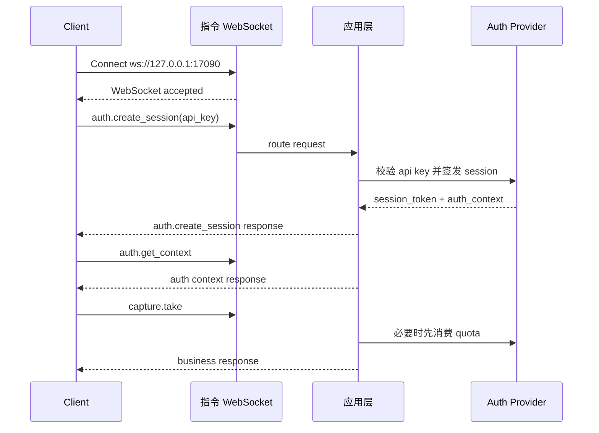

# CZUR Open SDK 指令通道说明

[English version](./COMMAND_CHANNEL_FLOW.md)

## 概述

本文档描述 `sdk_open` 当前已经实现的 command WebSocket 建连与通信逻辑。

核心规则：

- 先建立指令 WebSocket
- WebSocket 握手本身保持匿名
- 长效 API Key 通过 `auth.create_session` 发送给服务端
- 服务端把返回的 `session_token` 绑定到当前指令连接
- 后续业务请求不再重复携带鉴权字段
- 离线 API Key 可通过 `auth.activate_offline` 在本机解封
- `capture.take`、`image.process`、`image.process_page`、`image.apply_color_mode`、`file.convert` 带 quota 控制

默认地址：

- `ws://127.0.0.1:17090`

## 建连模型

客户端先建立指令通道：

```text
ws://127.0.0.1:17090
```

连接建立后：

- `system.*` 可直接调用
- `auth.create_session` 校验 API Key 并签发连接绑定的 `session_token`
- `auth.get_context` 返回当前 `auth_context`
- `auth.activate_offline` 可把一个离线 API Key 从受限状态升级为本机解封状态
- `auth.refresh_session` 用于轮换会话 token
- 业务方法默认复用当前连接绑定的会话

## 请求模型

统一请求结构：

```json
{
  "request_id": "req-001",
  "method": "auth.create_session",
  "params": {
    "token": "sk-sq-v1-xxxx"
  },
  "client": {
    "source": "demo-site",
    "protocol_version": "2.0.0",
    "trace_id": "trc-001"
  }
}
```

说明：

- `request_id` 是唯一公开请求标识
- `method` 是方法名
- `params` 是方法参数
- `client` 是可选的来源与 tracing 信息
- 请求体不再携带 `auth.session_key` 或 `auth.session_token`

## 响应模型

统一响应结构：

```json
{
  "request_id": "req-001",
  "code": 0,
  "message": "ok",
  "data": {},
  "ts": 1710000000
}
```

## 事件模型

服务端主动事件与请求响应分离：

```json
{
  "event": "video.ready",
  "code": 0,
  "message": "ok",
  "payload": {
    "stream_id": "stream-001"
  },
  "ts": 1710000001
}
```

## 授权流程

### 1. 建立指令通道

客户端连接 command WebSocket，不在握手 URL 中塞 API Key。

### 2. 使用 API Key 创建连接绑定会话

```json
{
  "request_id": "req-auth-001",
  "method": "auth.create_session",
  "params": {
    "token": "sk-sq-v1-xxxx"
  }
}
```

成功响应示例：

```json
{
  "request_id": "req-auth-001",
  "code": 0,
  "message": "ok",
  "data": {
    "session_token": "ss-v1-xxxx",
    "expires_in": 7200,
    "auth_context": {
      "is_valid": true,
      "account_type": "svip",
      "account_type_code": 1,
      "auth_scene": "plugin",
      "license_mode": "offline_api_key",
      "entitlement_state": "offline_limited",
      "machine_code": "MC-xxxx",
      "device_scope": [
        { "vid": 4660, "pid": 22136 }
      ],
      "capabilities": [
        "system.ping",
        "system.info",
        "system.capabilities",
        "auth.create_session",
        "auth.get_context",
        "auth.refresh_session",
        "auth.activate_offline",
        "auth.destroy_session",
        "capture.take",
        "image.process",
        "image.process_page",
        "image.apply_color_mode",
        "file.convert"
      ],
      "quota_buckets": [
        {
          "bucket": "capture",
          "methods": ["capture.take"],
          "limit": 5,
          "remaining": 5,
          "enforcement": "local_quota"
        }
      ]
    }
  },
  "ts": 1710000002
}
```

### 3. 读取当前会话上下文

```json
{
  "request_id": "req-auth-ctx-001",
  "method": "auth.get_context",
  "params": {}
}
```

### 4. 在本机解封离线 API Key

只有离线 API Key 需要这一步。客户端先走私有授权流程拿到与当前机器码对应的授权码，然后调用：

```json
{
  "request_id": "req-auth-offline-001",
  "method": "auth.activate_offline",
  "params": {
    "auth_code": "CZUR-xxxx"
  }
}
```

成功后：

- `auth_context.entitlement_state` 会从 `offline_limited` 切到 `offline_unlocked`
- 服务端会立即返回新的 `session_token`
- `capture.take`、图像处理类方法、`file.convert` 的本地 quota 限制停止生效

### 5. 调用业务方法

业务请求不再重复传 session：

```json
{
  "request_id": "req-capture-001",
  "method": "capture.take",
  "params": {
    "device_id": "device-001"
  }
}
```

运行时会依次校验：

- 当前连接是否已绑定合法会话
- 当前 capability 是否允许
- 设备 scope 是否允许
- `capture.take`、图像处理类方法、`file.convert` 是否还能继续消费 quota

纸张处理扩展参数在采集方法中通过 `params.profile.capture` 传递，在 `image.process` 或 `image.process_page` 中通过顶层 `params.single_page` / `params.curved_book` 传递。单页模式支持：

- `single_page.crop_border.enabled/width/height`：裁边开关与裁边参数，`width/height` 范围为 `-100..100`。
- `single_page.id_card_round_corner`：证件圆角留白。
- `single_page.auto_rotate`：页面自动转正。
- `single_page.smart_black_edge_optimize`：智能优化黑边，默认开启。
- `single_page.multi_target_paging`：多目标自动分页，可输出多页资产。
- `single_page.realtime_detect_rects`：仅采集/视频流生效。视频流是否返回实时识别框；关闭后后端不在每帧做目标检测。

曲面书籍模式支持：

- `curved_book.remove_finger.enabled`：清除手指开关。
- `curved_book.remove_finger.finger_type`：`with_sleeve` 或 `without_sleeve`。
- `curved_book.smart_paging`：是否左右分页；关闭时输出整张展平图。
- `curved_book.crop_border.enabled/width/height`：裁边开关与裁边参数。
- `curved_book.auto_complete`：页面自动补全。

独立 `image.process` 的曲面书籍处理只使用基于边缘的展平。激光线展平仅在采集流中对支持激光线的设备生效，因为它依赖设备激光标定数据，以及和原图同时采集得到的激光图。

`video.set_profile` 可以运行时更新 `single_page.realtime_detect_rects` 和 `single_page.multi_target_paging`，无需重开视频流。

`image.process` 作为兼容接口保留，仍然在一次调用里串联纸张处理、色彩模式和格式转换。新接入建议使用拆分后的接口：

- `image.process_page`：只执行页面/纸张处理，并保持源图片格式。
- `image.apply_color_mode`：只执行色彩模式处理，并保持源图片格式。
- `file.convert`：执行图片输入的文件转换，包括 JPG/PNG/TIFF 图片格式转换，以及图片生成 PDF/OFD/TIFF 文档。

兼容 `image.process` 示例：

```json
{
  "request_id": "req-image-001",
  "method": "image.process",
  "params": {
    "input_upload_id": "img-1760000000-1",
    "output_dir": "/tmp/sdk-demo",
    "page_processing": "single_page",
    "color_mode": "auto_optimize",
    "output_format": "jpg",
    "single_page": {
      "crop_border": { "enabled": false, "width": 0, "height": 0 },
      "auto_rotate": true,
      "smart_black_edge_optimize": true,
      "multi_target_paging": false
    }
  }
}
```

拆分后的纸张处理示例：

```json
{
  "request_id": "req-page-001",
  "method": "image.process_page",
  "params": {
    "input_upload_id": "img-1760000000-1",
    "page_processing": "single_page",
    "single_page": {
      "crop_border": { "enabled": false, "width": 0, "height": 0 },
      "auto_rotate": true
    }
  }
}
```

拆分后的色彩模式示例：

```json
{
  "request_id": "req-color-001",
  "method": "image.apply_color_mode",
  "params": {
    "input_upload_id": "img-1760000000-1",
    "color_mode": "grayscale"
  }
}
```

图片和文档转换归属 `file.convert`。旧版 flat 参数继续兼容：

```json
{
  "request_id": "req-convert-001",
  "method": "file.convert",
  "params": {
    "input_upload_id": "img-1760000000-1",
    "output_format": "png"
  }
}
```

推荐使用结构化参数传入单张或多张上传图片，也可以传入一个已上传的 PDF/OFD/TIFF 文档：

```json
{
  "request_id": "req-convert-002",
  "method": "file.convert",
  "params": {
    "source": {
      "type": "images",
      "input_upload_ids": ["img-1760000000-1", "img-1760000000-2"]
    },
    "target": {
      "type": "pdf",
      "path": "/tmp/sdk-demo/converted.pdf"
    },
    "options": {
      "export_type": "multi-page",
      "quality": 90,
      "tiff_color": "color",
      "tiff_compression": "lzw"
    }
  }
}
```

目标格式支持 `jpg`、`jpeg`、`png`、`tiff`、`pdf`、`ofd`。JPG/PNG 目标是逐页/逐图输出；PDF/OFD/TIFF 目标既可以多页合一，也可以逐页/逐图输出。`export_type: "single-page"` 会把输出写到 `target.dir`，响应返回 `output_paths`。

`file.convert` 会把输入统一视为有序页集合。图片输入是一图一页；PDF/OFD/TIFF 输入可以通过 `source.pages` 选择页码，页码从 1 开始，支持 `"all"` 或 `"1,3-5"`。

| 输入 | 目标 | `export_type` | 行为 |
| --- | --- | --- | --- |
| 单张或多张图片 | `pdf` / `ofd` / `tiff` | `multi-page` | 合成为一个多页文件 |
| 单张或多张图片 | `jpg` / `png` / `tiff` / `pdf` / `ofd` | `single-page` | 每张图片输出一个文件 |
| PDF/OFD/TIFF 文档 | `jpg` / `png` / `tiff` | `single-page` | 每个选中页渲染为一个图片/TIFF 文件 |
| PDF/OFD/TIFF 文档 | `pdf` / `ofd` / `tiff` | `single-page` | 每个选中页输出一个单页文档 |
| PDF/OFD/TIFF 文档 | `pdf` / `ofd` / `tiff` | `multi-page` | 选中页合成为一个目标文档 |

JPG/PNG 目标只支持 `export_type: "single-page"`。PDF/OFD/TIFF 文档来源本轮每次请求只接受一个输入文档。跨文档格式转换按页面视觉结果转换，不承诺保留文本、矢量和语义结构。

文档拆分页示例：

```json
{
  "request_id": "req-convert-003",
  "method": "file.convert",
  "params": {
    "source": {
      "type": "pdf",
      "input_upload_id": "img-1760000000-3",
      "pages": "1,3-5"
    },
    "target": {
      "type": "png",
      "dir": "/tmp/sdk-demo/pages"
    },
    "options": {
      "export_type": "single-page",
      "quality": 90,
      "render_dpi": 144
    }
  }
}
```

Demo 站点通过资源服务的 `POST /api/uploads/files` 上传浏览器选择的本地文件，默认地址为 `http://127.0.0.1:17082`。请求使用 multipart form-data，字段名为 `file`，并携带 `Authorization: Bearer <session_token>`。响应会返回 `upload_id` 和原始 asset。图像处理类方法可以使用图片 upload id；`file.convert` 可以使用图片、PDF、OFD 或 TIFF 的 upload id。

`selected_area` 模式下，前端把换算后的区域点传入 `params.selected_area.points`，并通过 `params.selected_area.source.width/height` 传入坐标基准尺寸。后端会再按实际输入图片尺寸缩放坐标后裁剪。响应里 `output_path` 指向第一页，`outputs[]` 返回单页或多页结果。

OCR 与识别方法：

- `ocr.extract_text`：对单张图片做轻量 OCR，返回文字块和图片坐标系下的矩形。
- `ocr.recognize`：提交异步 OCR 导出任务。支持 `input_upload_ids` 或 `input_files`、可选 `output_path` 或 `output_dir`、`format`，以及 `encoding`、`paperSize`、`exportType`、`ocrPreference`、`quality`、`exportFormat` 等导出参数。导出格式支持 `txt`、`pdf`、`docx`、`xlsx`、`ofd`、`json`。
- `ocr.get`：查询 OCR 任务状态。
- `ocr.cancel`：请求取消 OCR 任务。
- `recognition.barcode_detect`：对静态图片做条码/二维码识别。实时条码识别归属采集/视频流，不由该方法启动。

OCR 文字块提取示例：

```json
{
  "request_id": "req-ocr-text-001",
  "method": "ocr.extract_text",
  "params": {
    "input_upload_id": "img-1760000000-1"
  }
}
```

OCR 导出示例：

```json
{
  "request_id": "req-ocr-001",
  "method": "ocr.recognize",
  "params": {
    "input_upload_ids": ["img-1760000000-1", "img-1760000000-2"],
    "output_path": "/tmp/demo.txt",
    "format": "txt",
    "exportType": "multi-page",
    "encoding": "utf-8",
    "quality": 90
  }
}
```

如果 `multi-page` 不传 `output_path`，SDK 会在自己的任务资产目录生成结果文件，并在 `data.task.assets[].download_url` 返回可下载地址。客户端可下载到本地用户选择的最终路径。

如果需要一张图片导出一个文件，传 `exportType: "single-page"` 和 `output_dir`。响应会返回 `data.output_paths`、`data.task.output_paths` 和可下载 assets。

OCR 任务查询/取消示例：

```json
{ "request_id": "req-ocr-get-001", "method": "ocr.get", "params": { "task_id": "ocr-1" } }
{ "request_id": "req-ocr-cancel-001", "method": "ocr.cancel", "params": { "task_id": "ocr-1" } }
```

条码识别示例：

```json
{
  "request_id": "req-barcode-001",
  "method": "recognition.barcode_detect",
  "params": {
    "input_upload_id": "img-1760000000-1",
    "formats": ["qrcode", "pdf417", "code128"]
  }
}
```

### 6. 刷新或销毁会话

支持的方法：

- `auth.refresh_session`
- `auth.destroy_session`

## 离线与在线 API Key

### 离线 API Key

- `license_mode` 为 `offline_api_key`
- 默认状态为 `offline_limited`
- 当前机器码会通过 `auth_context.machine_code` 返回
- `capture.take`、图像处理类方法、`file.convert` 默认走本地 quota 限制
- `auth.activate_offline` 成功后状态切为 `offline_unlocked`

### 在线 API Key

- `license_mode` 为 `online_api_key`
- 创建会话时会调用配置的 HTTP 授权服务
- `capture.take`、图像处理类方法、`file.convert` 每次调用前都会走远端 quota 校验
- 当前实现直接支持 `http://...` 在线授权地址

## 访问规则

- `system.*` 可匿名调用
- `auth.create_session` 可匿名调用
- `auth.get_context`、`auth.refresh_session`、`auth.activate_offline`、`auth.destroy_session` 需要当前连接已有合法会话
- 其他业务方法默认都要求当前连接已有合法会话

常见失败码：

- `1100`：需要认证
- `1101`：API Key 非法
- `1102`：API Key 已过期
- `1103`：`session_token` 非法或已过期
- `1107`：当前会话不具备目标 capability
- `1108`：离线授权码非法
- `1109`：在线授权服务不可用
- `1110`：配额已耗尽
- `1111`：离线授权码与当前机器不匹配

## 与 Video WS 的关系

- `device.close`、`video.start`、`video.stop`、`video.set_format` 仍然走 command WS
- video WS 只负责视频帧输出和流相关事件
- video WS 使用 `session_token + stream_id` 建连

示例：

```text
ws://127.0.0.1:17091?session_token=ss-v1-xxxx&stream_id=stream-001
```

## 时序示例


